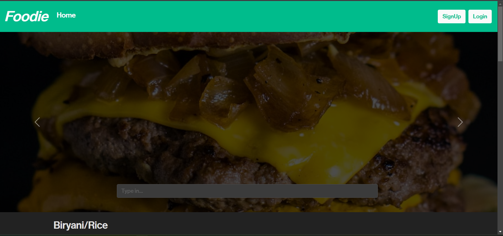
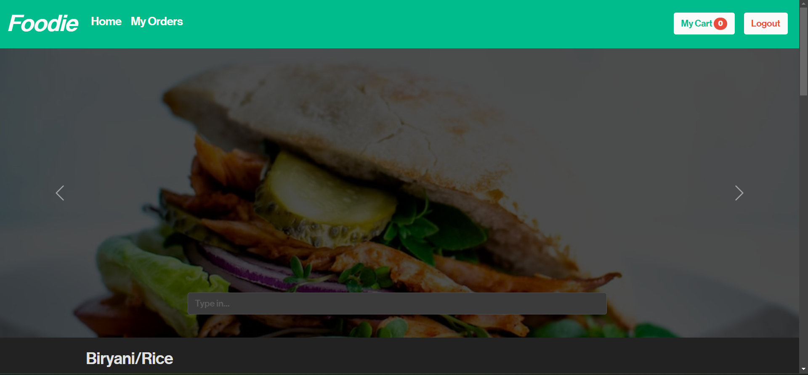
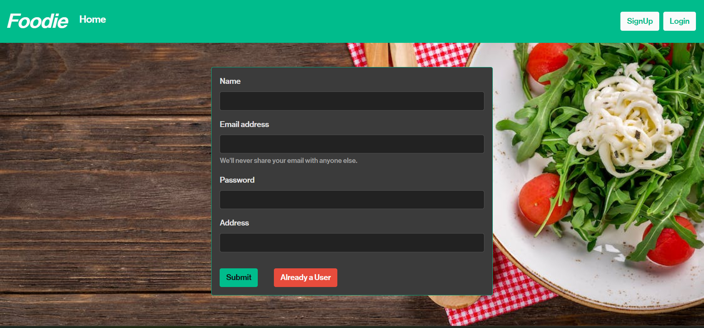
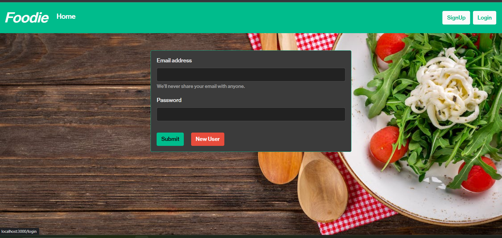
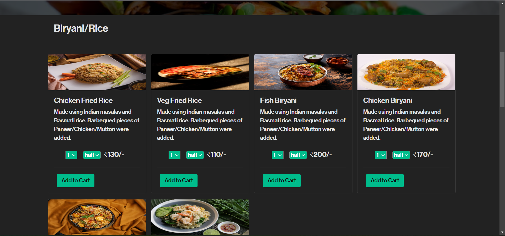
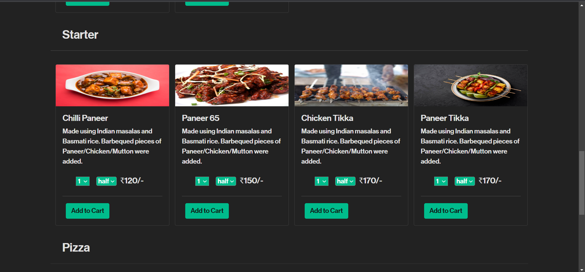
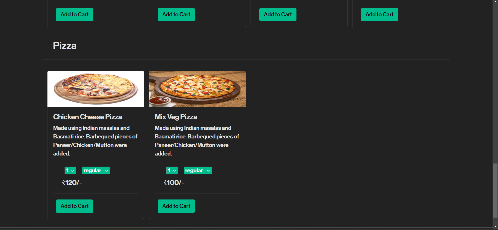
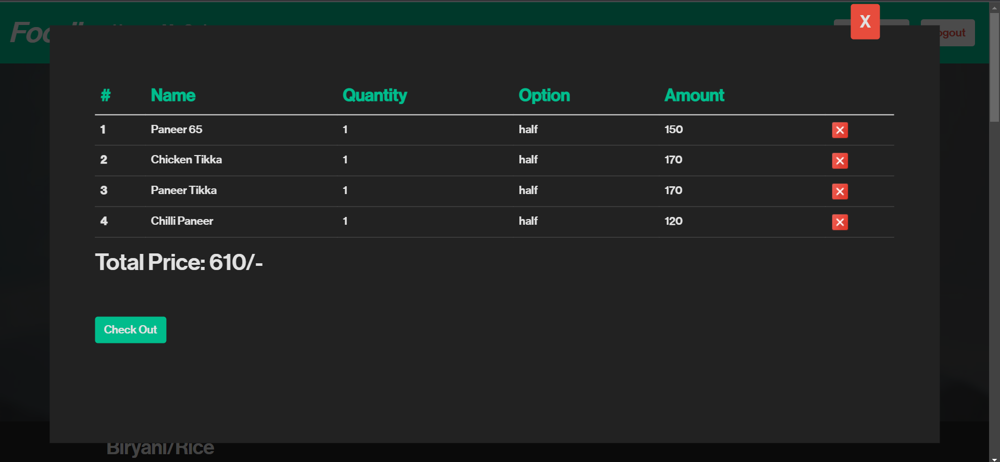
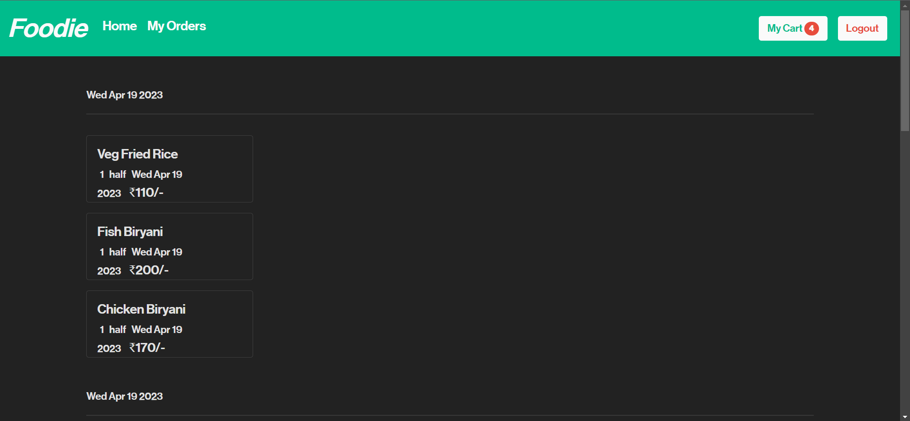

  I have built a Food Delivery app using MERN stack, which means my app likely has the following components:

MongoDB: This is a NoSQL database that stores my app's data. In my case, i  have a collection of menus, orders, and customers.

ExpressJS: This is a web framework for NodeJS that provides a set of tools and features for building web applications. i have used ExpressJS to handle routing, middleware, and HTTP requests.

ReactJS: This is a JavaScript library for building user interfaces. In my case, i have used ReactJS to create the frontend of my app, including the pages, components, and user interface elements.

NodeJS: This is a JavaScript runtime environment that allows you to run JavaScript code outside of a web browser. i have used NodeJS to handle server-side logic, including database operations, API requests, and server-side rendering of my React components.

My Food Delivery app has the following features:

Menu browsing: Users can browse the menus of different restaurants and see the prices, descriptions, and images of the dishes.

Order placement: Users can place an order from a restaurant by selecting the items they want, customizing them if necessary, and adding them to their cart.

User management: Users can create an account, sign in, view their order history, and manage their profile information.

Overall, my MERN stack Food Delivery app is  a sophisticated web application that leverages modern technologies to provide a seamless user experience for customers ordering food.
Here are some images  showing how the web app looks like.         
    
    
    
    
    
    
    
    
    
      
# Getting Started with Create React App

This project was bootstrapped with [Create React App](https://github.com/facebook/create-react-app).

## Available Scripts

In the project directory, i can run:

### `npm start`

Runs the app in the development mode.\
Open [http://localhost:3000](http://localhost:3000) to view it in my browser.

The page will reload when i make changes.\
i may also see any lint errors in the console.

### `npm test`

Launches the test runner in the interactive watch mode.\
See the section about [running tests](https://facebook.github.io/create-react-app/docs/running-tests) for more information.

### `npm run build`

Builds the app for production to the `build` folder.\
It correctly bundles React in production mode and optimizes the build for the best performance.

The build is minified and the filenames include the hashes.\
my app is ready to be deployed!

See the section about [deployment](https://facebook.github.io/create-react-app/docs/deployment) for more information.

### `npm run eject`

**Note: this is a one-way operation. Once i `eject`, i can't go back!**

If i aren't satisfied with the build tool and configuration choices, i can `eject` at any time. This command will remove the single build dependency from my project.

Instead, it will copy all the configuration files and the transitive dependencies (webpack, Babel, ESLint, etc) right into my project so i have full control over them. All of the commands except `eject` will still work, but they will point to the copied scripts so i can tweak them. At this point i're on my own.

i don't have to ever use `eject`. The curated feature set is suitable for small and middle deployments, and i shouldn't feel obligated to use this feature. However we understand that this tool wouldn't be useful if i couldn't customize it when i are ready for it.

## Learn More

i can learn more in the [Create React App documentation](https://facebook.github.io/create-react-app/docs/getting-started).

To learn React, check out the [React documentation](https://reactjs.org/).

### Code Splitting

This section has moved here: [https://facebook.github.io/create-react-app/docs/code-splitting](https://facebook.github.io/create-react-app/docs/code-splitting)

### Analyzing the Bundle Size

This section has moved here: [https://facebook.github.io/create-react-app/docs/analyzing-the-bundle-size](https://facebook.github.io/create-react-app/docs/analyzing-the-bundle-size)

### Making a Progressive Web App

This section has moved here: [https://facebook.github.io/create-react-app/docs/making-a-progressive-web-app](https://facebook.github.io/create-react-app/docs/making-a-progressive-web-app)

### Advanced Configuration

This section has moved here: [https://facebook.github.io/create-react-app/docs/advanced-configuration](https://facebook.github.io/create-react-app/docs/advanced-configuration)

### Deployment

This section has moved here: [https://facebook.github.io/create-react-app/docs/deployment](https://facebook.github.io/create-react-app/docs/deployment)

### `npm run build` fails to minify

This section has moved here: [https://facebook.github.io/create-react-app/docs/troubleshooting#npm-run-build-fails-to-minify](https://facebook.github.io/create-react-app/docs/troubleshooting#npm-run-build-fails-to-minify)
